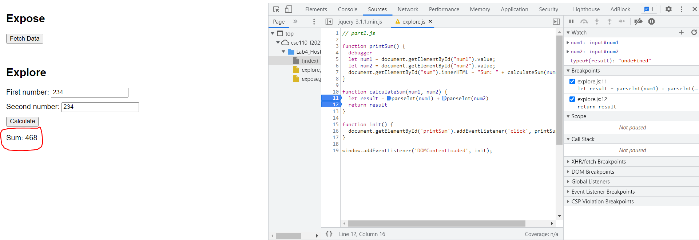

# DevTools Part 2 (Explore)

- Question 1: The bug was that the code was doing string concatenation and not number addition. Thus, it was treating num1 and num2 as strings and just sticking them together.
- Question 2: It's a fairly easy fix. You can just use parseInt where result is set up: `let result = parseInt(num1) + parseInt(num2)`  
  
- NOTE FOR THE SCREENSHOT QUESTIONS: I am following what Satyam suggested and that it was fine to include an extra breakpoint for my own debugging. He also said that the screenshot should be when the breakpoint is activated which is what I have done.